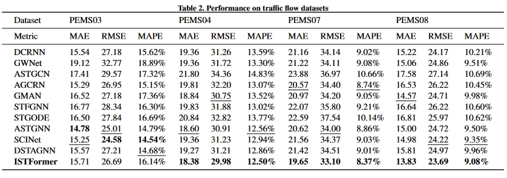

# ISTFormer
This is the pytorch implementation of ISTFormer. I hope these codes are helpful to you!


## Requirements
The code is built based on Python 3.9.12, PyTorch 1.11.0, and NumPy 1.21.2.

## Datasets 
You can get preprocessed NYC datasets that you can access [here](https://drive.google.com/drive/folders/1-5hKD4hKd0eRdagm4MBW1g5kjH5qgmHR?usp=sharing). If you need PEMS datasets, please refer to [STSGCN](https://github.com/Davidham3/STSGCN) (including PEMS03, PEMS04, PEMS07, and PEMS08).

## Train Commands
It's easy to run! Here are some examples for run.ipynb, and you can customize the model settings in ISTFtrainer.py.
### PEMS08
```
%run ISTFtrainer.py --data PEMS08 --epochs 40 --save './logs/epoch40_20240615'
```
### NYCBike Drop-off
```
%run ISTFtrainer.py --data bike_drop --epochs 1 --save './NYC/bike_drop_epoch1'
```

## Results
<p align="center">

</p>
<p align="center">

</p>

## Acknowledgments
Our model is built based on model of [STAEformer],[SCINet] and [STIDGCN]
